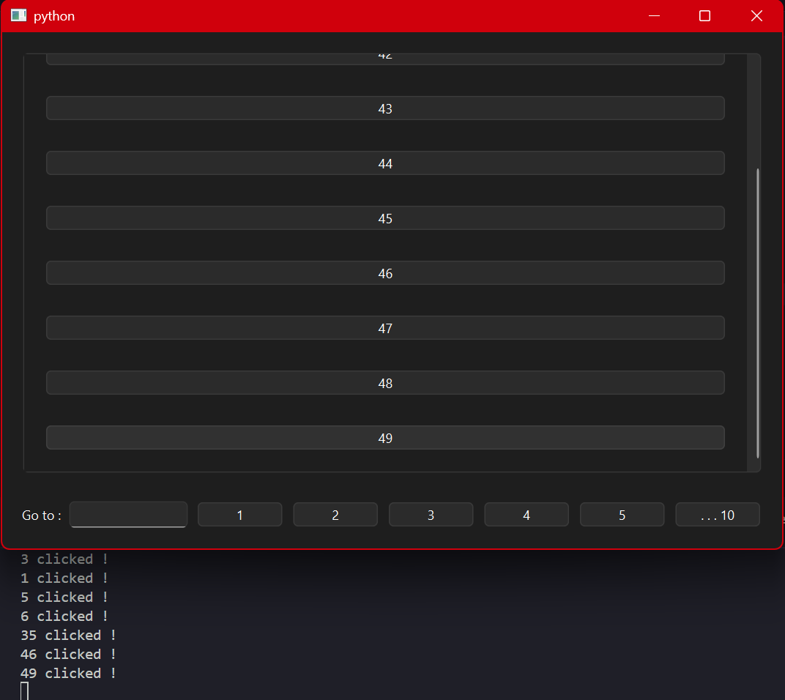

# widgets_pagination_view
A lib that let you organise a list of inheritance of Pyside6.QtWidgets.QWigdet in a pagination view.

## How does it works ?
This package takes a list of objects that inherit from `Pyside6.QtWidgets.QWidget` and organizes them evenly into pages (which are derived from QtWidgets.QWidget).

## Usage

First, create a new instance of a WidgetsPaginationView (this is the widgets which handle your widgets)

```py
from PySide6 import QtWidgets
from widgets_pagination_view import InPageWidget, WidgetsPaginationView

# Creating the Qt App
app = QtWidgets.QApplication()

# Creating a main window
main_window = QtWidgets.QMainWindow()

# Creating the base class of the widgets
class MyButton(InPageWidget):

    def __init__(self, text):
        super().__init__()
        self.lyt = QtWidgets.QHBoxLayout()
        self.setLayout(self.lyt)
        self.button = QtWidgets.QPushButton(text)
        self.lyt.addWidget(self.button)
        self.button.clicked.connect(lambda: print(text, "clicked !"))

# Creating some widgets
buttons = [MyButton(str(i)) for i in range(100)]

# Creating a new instance of WidgetsPaginationView
w_page_view = WidgetsPaginationView(
    parent=None,
    widgets = buttons,
    max_loadables_pages_count=5,
    widgets_by_page_count=10,
    )

# Define w_pages_view as the central widget
main_window.setCentralWidget(w_page_view)

#Showing the window
main_window.show()

#Launching the app
app.exec()
```
`parent`: A valid QtWidgets.QWidget parent widget or `None`.

`widgets`: The list of widgets to display (as in the example, widgets must inherit from the InPageWidget class of the package).

`max_loadables_pages_count`: By default, this package loads and unloads widget pages on every page change, which optimizes performance and prevents slowdowns. The `max_loadables_pages_count` variable defines the maximum number of pages that can be loaded into memory simultaneously.

The `widgets_by_pages_count` parameter defines the number of widgets that each page can contain.

The result : 

## Installation

```bash
pip install widgets_pagination_view

# Or

python -m pip install widgets_pagination_view
```

## Requirements

This project requires the following packages (they will be installed automatically):

- PySide6